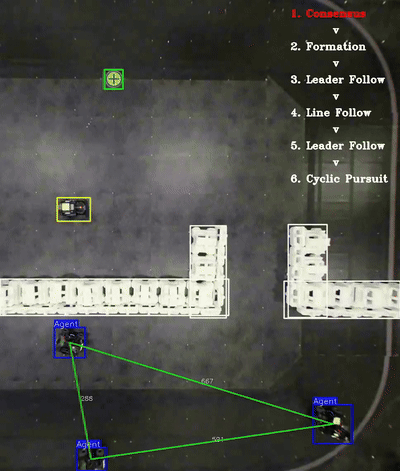

# 군집로봇 실시간 제어 테스트베드 개발

## 📗 목차

1. [📝 개요](#📝-1.-프로젝트-개요)
2. [📚 문제정의](#📚-2.-문제정의)
3. [📃 문제해결 아이디어](#📃-3.-문제해결-아이디어)
4. [⚙️ 시스템 구축 과정](#⚙️-4.-시스템-구축-과정)
5. [📈 개발결과](#📈-5.-개발결과)
6. [🛠️ 성능 개선방안](#-6.-성능-개선방안)
7. [💡 결론](#💡-7.-결론)

## **📝 1. 프로젝트 개요**
- 프로젝트 명: 군집로봇 실시간 제어 테스트베드 개발
- 프로젝트 기간: 3M/M 2021.12 - 2022.03
- 기술스택: Python, Pytorch, Numpy, Opencv

## **📚 2. 문제정의**
- 인공지능 기술이 발전함에 따라 군집 드론/로봇의 연구가 활발함
- 무인 이동체의 군집 운용 알고리즘 개발을 위한 통합 실험 시스템이 필요함
- 실시간으로 제어 알고리즘 검증 가능한 군집 로봇 테스트베드가 요구됨
- 다수 로봇의 센서 데이터, 위치 정보 수집을 통한 알고리즘 성능을 분석할 수 있는 시스템이 필요함
- 관련 솔루션이 부족하며, 커스터마이징 요청 시 매우 큰 비용이 소모됨

## **📃 3. 문제해결 아이디어**
### 장치 준비
- 군집 로봇: 드론 제작 업체로 유명한 DJI사의 제품 활용 (Python 기반 SDK 제공)
- 글로벌 위치 획득 장치: Motion track 장치 "Optitrack-Motive" 장비를 도입하여 물체의 정밀한 좌표를 실시간 획득
- 중앙 처리 장치: Windows 운영체제 PC

### 장치 연동
- Python 멀티쓰레딩을 활용하여 개별 장치를 실시간 연동
- 센서 데이터(위치, 장애물과의 거리) 획득
- 중앙 PC 에서 획득한 데이터 기반으로 제어 신호 계산 후 로봇으로 전송

## **⚙️ 4. 시스템 구축 과정**

### 장치 연동
- 위치 획득 장치, 로봇(및 센서), PC 간 실시간 정보 송/수신 체계 구축 (Python+멀티쓰레딩)
- 위치 획득 장치의 데이터 송/수신 옵션을 활용하여 PC로 정보 브로드캐스팅 설정

### Plant
- 위치측정센서: 적외선카메라 장비 및 Optitrack-Motive 프로그램
- 거리측정센서: 로봇 전방에 탑재된 적외선 기반 거리측정 센서
- 휠 액추에이터: Mechanum 휠 구동 시스템을 가진 4개의 개별 액추에이터

### Estimation (위치 추정부)
- 획득한 브로드캐스팅 정보에서 각 로봇 별 위치 정보 접근
- 기존에 제공되는 쿼터니언(Quaternion) 좌표계를 데카르트(Cartesian) 좌표계로 변환
- 각 로봇의 $x, y, \theta$ (회전각도) 정보를 버퍼에 저장

### Control algorithm (제어 알고리즘부)
#### 제어 단계 계층별 설계
- High level: 사용자의 최종 달성 목표 설정
    - e.g. 대대장 (상급 부대) 의 공격 지시
- Middle level: High level의 요구에 적합한 알고리즘 계산
    - e.g. 소대장은 각 병사에게 개별 명령 (목적지까지 이동) 지시
- Low level: Middle level 의 지시를 수행
    - e.g. 각 병사는 목적지 까지 각자의 상황에 맞게 (장애물을 회피하여) 이동

## **📈 5. 개발결과**
<table>
  <tr>
    <td></td>
    <td></td>
    <td></td>
    <td rowspan="2"></td>
  </tr>
  <tr>
    <td></td>
    <td></td>
    <td></td>
  </tr>
</table>

### 제어 알고리즘 예제
- Go to goal: 목표 지점까지 이동
- Avoid obstacle: 장애물 회피하며 목표 지점으로 이동
- Consensus: 다중 에이전트 간 합의

- Formation: 특정 대형 형성
- Leader following: 대형 유지 및 리더 추적
- Cyclic pursuit: 특정 대상을 원형 보호

## **🛠️ 6. 성능 개선방안**
- PC와 로봇 간 Downlink, Uplink 주기 개선을 위해 멀티쓰레딩을 멀티프로세싱으로 변경
- 분산 컴퓨팅을 위해 각 로봇의 임베디드 운영체제인 Android 레벨에서 비동기식 데이터 송/수신 및 제어 알고리즘 처리

## **💡 7. 결론**
### 군집로봇 제어 테스트베드 구축완료
  - 실시간성 보장: 약 50Hz 주기로 업데이트
  - 데이터 수집/기록 통한 분석 가능
  - 제어 알고리즘의 계층별 설계로 인한 변경/확장 용이성
    - 알고리즘 추가 시 : Middle level 수정
    - 로봇 변경 시: Low level 수정
